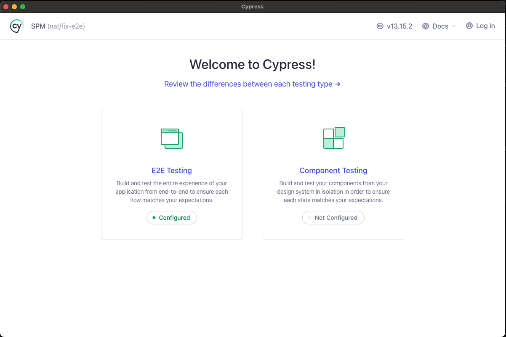
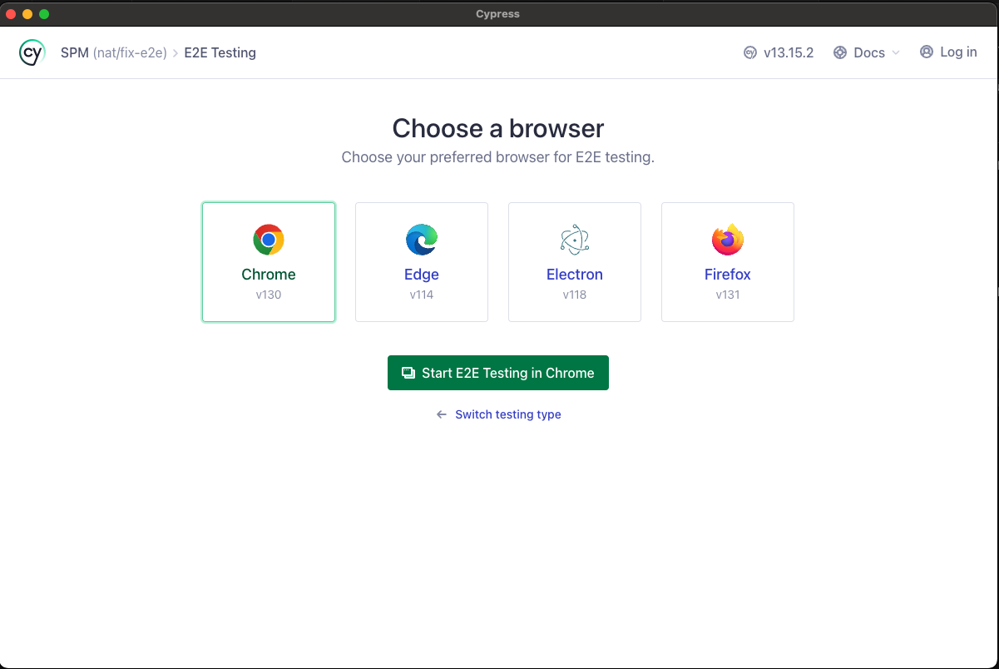
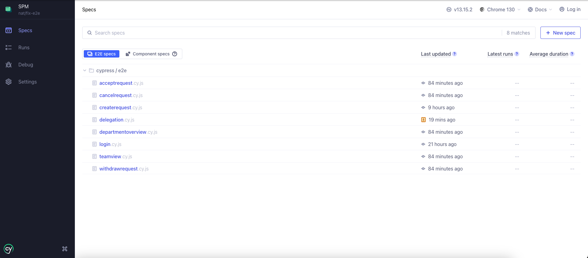

# SPM:

This project contains a frontend and backend application that can be easily spun up using Docker Compose.

## Table of Contents
- [Prerequisites](#prerequisites)
- [Deployment](#deployment)
- [Project Structure](#project-structure)
- [Getting Started](#getting-started)
   - [Setup development environment](#setup-development-environment)
   - [Start the application](#start-the-application)
   - [Starting Individual Components](#starting-individual-components)
- [Stopping the Application](#stopping-the-application)
- [Logs](#logs)
- [Troubleshooting](#troubleshooting)
- [Testing](#testing)
   - [Backend](#backend)
   - [End To End](#end-to-end)

## Prerequisites

Before you begin, ensure you have the following installed on your system:

- [Docker](https://www.docker.com/get-started)
- [Docker Compose](https://docs.docker.com/compose/install/)


## Deployment
[Link to Deployed AllInOne Application](http://ec2-13-229-155-198.ap-southeast-1.compute.amazonaws.com/login)

### Credentials:
#### Set 1
**Manager**
- Email: Ernst.Sim@allinone.com.sg
- Password: password

**Employee**
- Email: Priya.Lim@allinone.com.sg
- Password: password

#### Set 2
**Manager**
- Email: David.Yap@allinone.com.sg
- Password: password

**Employee**
- Email: Narong.Pillai@allinone.com.sg
- Password: password

#### Set 3
**Manager**
- Email: Rahim.Khalid@allinone.com.sg
- Password: password

**Employee**
- Email: William.Fu@allinone.com.sg
- Password: password

#### HR
**HR**
- Email: Sally.Loh@company.com
- Password: password

#### Special Case (Managing Director)
**Managing Director**
- Email: Jack.Sim@allinone.com.sg
- Password: password

#### All Login Credentials
- [Click Here](/Login_Credentials.xlsx)

## Project Structure

```
SPM/
├─ .dockerignore
├─ .gitignore
├─ .pre-commit-config.yaml
├─ .pytest_cache/
├─ backend/
│  ├─ .coveragerc
│  ├─ .pytest_cache/
│  ├─ Dockerfile
│  ├─ htmlcov/
│  ├─ main.py
│  ├─ pytest.ini
│  ├─ README.md
│  ├─ requirements.prod.txt
│  ├─ requirements.txt
│  └─ src/
│     ├─ app.py
│     ├─ arrangements/
│     │  ├─ archive/
│     │  │  └─ scheduler.py
│     │  ├─ commons/
│     │  │  ├─ dataclasses.py
│     │  │  ├─ enums.py
│     │  │  ├─ exceptions.py
│     │  │  ├─ models.py
│     │  │  └─ schemas.py
│     │  ├─ crud.py
│     │  ├─ routes.py
│     │  ├─ services.py
│     │  ├─ utils.py
│     │  └─ __init__.py
│     ├─ auth/
│     │  ├─ models.py
│     │  ├─ routes.py
│     │  ├─ utils.py
│     │  └─ __init__.py
│     ├─ base.py
│     ├─ database.py
│     ├─ email/
│     │  ├─ config.py
│     │  ├─ exceptions.py
│     │  ├─ models.py
│     │  ├─ routes.py
│     │  ├─ schemas.py
│     │  └─ __init__.py
│     ├─ employees/
│     │  ├─ crud.py
│     │  ├─ dataclasses.py
│     │  ├─ exceptions.py
│     │  ├─ models.py
│     │  ├─ routes.py
│     │  ├─ schemas.py
│     │  ├─ services.py
│     │  └─ __init__.py
│     ├─ health/
│     │  ├─ health.py
│     │  └─ __init__.py
│     ├─ init_db/
│     │  ├─ auth.csv
│     │  ├─ data_preprocessing.ipynb
│     │  ├─ employee.csv
│     │  ├─ latest_arrangement.csv
│     │  ├─ load_data.py
│     │  └─ __init__.py
│     ├─ logger.py
│     ├─ notifications/
│     │  ├─ commons/
│     │  │  ├─ dataclasses.py
│     │  │  └─ structs.py
│     │  ├─ email_notifications.py
│     │  └─ exceptions.py
│     ├─ schemas.py
│     ├─ tests/
│     │  ├─ arrangements/
│     │  │  ├─ cat.png
│     │  │  ├─ dog.jpg
│     │  │  ├─ dummy.pdf
│     │  │  ├─ test_crud.py
│     │  │  ├─ test_exceptions.py
│     │  │  ├─ test_models.py
│     │  │  ├─ test_routes.py
│     │  │  ├─ test_schemas.py
│     │  │  ├─ test_services.py
│     │  │  ├─ test_utils.py
│     │  │  └─ __init__.py
│     │  ├─ auth/
│     │  │  ├─ test_models.py
│     │  │  ├─ test_routes.py
│     │  │  ├─ test_utils.py
│     │  │  └─ __init__.py
│     │  ├─ email/
│     │  │  ├─ test_exceptions.py
│     │  │  ├─ test_models.py
│     │  │  ├─ test_routes.py
│     │  │  └─ test_schemas.py
│     │  ├─ employees/
│     │  │  ├─ test_crud.py
│     │  │  ├─ test_exceptions.py
│     │  │  ├─ test_models.py
│     │  │  ├─ test_routes.py
│     │  │  ├─ test_services.py
│     │  │  └─ __init__.py
│     │  ├─ init_db/
│     │  │  ├─ test_auth.csv
│     │  │  ├─ test_employee.csv
│     │  │  ├─ test_latest_arrangement.csv
│     │  │  ├─ test_load_data.py
│     │  │  └─ __init__.py
│     │  ├─ notifications/
│     │  │  └─ test_email_notifications.py
│     │  ├─ test_utils.py
│     │  └─ __init__.py
│     ├─ utils.py
│     └─ __init__.py
├─ cypress/
│  ├─ downloads/
│  ├─ e2e/
│  │  ├─ acceptrequest.cy.js
│  │  ├─ cancelrequest.cy.js
│  │  ├─ createrequest.cy.js
│  │  ├─ delegation.cy.js
│  │  ├─ departmentoverview.cy.js
│  │  ├─ login.cy.js
│  │  ├─ teamview.cy.js
│  │  └─ withdrawrequest.cy.js
│  ├─ fixtures/
│  │  └─ example.json
│  └─ support/
│     ├─ commands.js
│     └─ e2e.js
├─ cypress.config.js
├─ docker-compose.yaml
├─ frontend/
│  ├─ .gitignore
│  ├─ .pytest_cache/
│  ├─ Dockerfile
│  ├─ nginx.conf
│  ├─ package-lock.json
│  ├─ package.json
│  ├─ public/
│  │  ├─ favicon.ico
│  │  ├─ index.html
│  │  ├─ logo192.png
│  │  ├─ logo512.png
│  │  ├─ manifest.json
│  │  └─ robots.txt
│  ├─ README.md
│  ├─ src/
│  │  ├─ App.css
│  │  ├─ App.tsx
│  │  ├─ common/
│  │  │  ├─ DashboardCards.tsx
│  │  │  ├─ DragAndDrop.tsx
│  │  │  ├─ Filters.tsx
│  │  │  ├─ Footer.tsx
│  │  │  ├─ Header.tsx
│  │  │  ├─ Layout.tsx
│  │  │  ├─ LoadingSpinner.tsx
│  │  │  ├─ Search.tsx
│  │  │  ├─ Sidebar.tsx
│  │  │  └─ SnackBar.tsx
│  │  ├─ components/
│  │  │  ├─ requests/
│  │  │  │  ├─ DateRow.tsx
│  │  │  │  ├─ DocumentDialog.tsx
│  │  │  │  ├─ EmployeeRow.tsx
│  │  │  │  └─ Recurring.tsx
│  │  │  └─ WFHRequestTable.tsx
│  │  ├─ context/
│  │  │  ├─ AppContextProvider.tsx
│  │  │  ├─ FilterContextProvider.tsx
│  │  │  └─ UserContextProvider.tsx
│  │  ├─ hooks/
│  │  │  ├─ arrangement/
│  │  │  │  ├─ arrangement.ts
│  │  │  │  └─ arrangement.utils.ts
│  │  │  ├─ auth/
│  │  │  │  ├─ auth.ts
│  │  │  │  └─ auth.utils.ts
│  │  │  ├─ employee/
│  │  │  │  ├─ delegation.utils.ts
│  │  │  │  └─ employee.utils.ts
│  │  │  └─ health/
│  │  │     ├─ health.ts
│  │  │     └─ health.utils.ts
│  │  ├─ index.css
│  │  ├─ index.tsx
│  │  ├─ logo.svg
│  │  ├─ pages/
│  │  │  ├─ hr/
│  │  │  │  ├─ chart/
│  │  │  │  │  └─ Chart.tsx
│  │  │  │  ├─ DepartmentOverviewPage.tsx
│  │  │  │  ├─ RequestHistory.tsx
│  │  │  │  ├─ Statistics.tsx
│  │  │  │  └─ StatsFilters.tsx
│  │  │  ├─ login-signup/
│  │  │  │  ├─ LoginPage.tsx
│  │  │  │  └─ SignUpPage.tsx
│  │  │  ├─ manager/
│  │  │  │  ├─ DelegateButton.tsx
│  │  │  │  ├─ DelegateManagerPage.tsx
│  │  │  │  ├─ PendingDelegations.tsx
│  │  │  │  ├─ ReviewRequests.tsx
│  │  │  │  └─ SendDelegation.tsx
│  │  │  ├─ staff/
│  │  │  │  ├─ CreateWfhRequest.tsx
│  │  │  │  ├─ HomePage.tsx
│  │  │  │  ├─ MyWfhSchedulePage.tsx
│  │  │  │  └─ PersonalRequests.tsx
│  │  │  └─ team/
│  │  │     ├─ AllRequests.tsx
│  │  │     ├─ ApprovedTeamRequests.tsx
│  │  │     ├─ PendingRequests.tsx
│  │  │     ├─ RequestList.tsx
│  │  │     └─ TeamPage.tsx
│  │  ├─ react-app-env.d.ts
│  │  ├─ reportWebVitals.ts
│  │  ├─ router/
│  │  │  └─ Routes.tsx
│  │  ├─ setupTests.ts
│  │  ├─ theme.js
│  │  ├─ types/
│  │  │  ├─ delegation.ts
│  │  │  ├─ requests.ts
│  │  │  └─ status.ts
│  │  └─ utils/
│  │     └─ utils.ts
│  ├─ tailwind.config.js
│  └─ tsconfig.json
├─ package-lock.json
├─ README.md
└─ scripts/
    ├─ setup.bat
    └─ setup.sh
```

## Getting Started
### Setup development environment
1. Ensure you are in the project root directory
2. (MacOS/Linux users only) Give permissions to run the setup script
```bash
chmod +x ./scripts/setup.sh
```
3. Run the setup script

MacOS/Linux users:
```bash
./scripts/setup.sh
```

Windows users:
```bash
scripts\setup.bat
```

4. Activate the `project_venv` **before starting any development work**

MacOS/Linux users:
```bash
source project_venv/bin/activate
```

Windows users:
```bash
.\project_venv\Scripts\activate
```

### Start the application

Follow these steps to get your development environment running:

1. Start the application using Docker Compose:

    ```
    docker-compose up -d
    ```

    This command will build the images if they don't exist and start the containers in detached mode.

3. Access the application:
    - Frontend: http://localhost:3000
    - Backend: http://localhost:8000

#### Services

The `docker-compose.yaml` file defines the following services:

- `frontend`: React application served by Nginx
- `backend`: FastAPI server

#### Development

To make changes to the application:

(Backend code should automatically update the app in the container, frontend still configuring. Otherwise, follow the steps below)

1. Modify the code in the `frontend/` or `backend/` directories.
2. Rebuild and restart the containers:

    ```
    docker-compose up -d --build
    ```

    ### Starting Individual Components

    Frontend: [HERE](frontend/README.md)
    Backend: [HERE](backend/README.md)

## Stopping the Application

To stop the application and remove the containers:

```
docker-compose down
```

To stop the application and remove the containers, networks, and volumes:

```
docker-compose down -v
```

## Logs

To view the logs of all services:

```
docker-compose logs
```

To view logs for a specific service:

```
docker-compose logs frontend
```

or

```
docker-compose logs backend
```

## Troubleshooting

If you encounter any issues:

1. Ensure all required ports are free and not used by other applications.
2. Check the logs for any error messages.
3. Try rebuilding the images: `docker-compose build --no-cache`

## Testing
Prerequisites: The `project_venv` is installed. If not, follow the instructions in the [Getting Started](#getting-started) section.

### Backend

1. Run the backend Docker container
2. Change to the backend directory
3. Run the following command to perform tests with coverage
    ```
    coverage run -m pytest
    ```
4. Run
    ```
    coverage report
    ```
    To view test coverage in the console, or for a more comprehensive report
    ```
    coverage html
    ```

### End To End
1. Run the backend Docker container on port 8000 using
   ```
   docker-compose up backend
   ```
2. Change directory to frontend. Run the frontend on port 3000 using
   ```
   npm start
   ```
3. Change back to the project root (SPM) and run the following command
    ```
    npx cypress open
    ```
    If you are using Cypress for the first time, you will need to install cypress first by using the following the command
    ```
    npm install cypress
    ```
    then follow the instructions in your terminal.

4. Cypress UI will open. Click on "E2E Testing".
    
5. Ensure Chrome is selected. Click on "Start E2E Testing in Chrome"
    
6. This will open Google Chrome. Click on any e2e spec to run the test suite for that functionality.
    